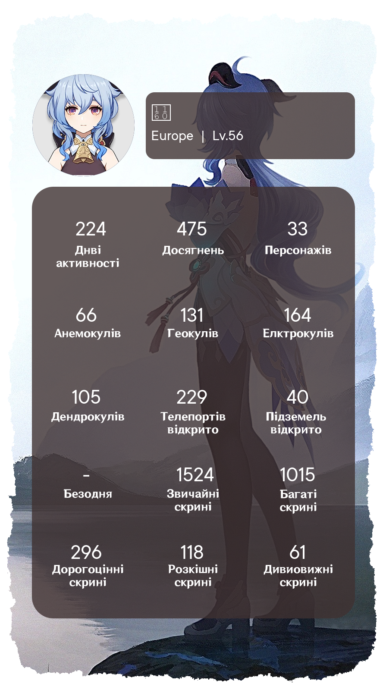

# Genshin Card
## This tool generates images with your statistics.

|     |Example 1|Example 2|Example 3|Default|
|-----|-----|-----|-----|-----|
|Params|CARD_AVATAR="Ganyu" <br> CARD_BG="bg_3" <br> CARD_LANG="lang_UA"|CARD_AVATAR="Diluc" <br> CARD_BG="bg_9" <br> CARD_LANG="lang_ENG"|CARD_AVATAR="Shenhe" <br> CARD_BG="bg_10" <br> CARD_LANG="lang_RU"|CARD_AVATAR=Default <br> CARD_BG=Default <br> CARD_LANG=Default|
|Immage||||


---

## How to use this tool?
**Fork this repository and you can move on to the next step.**

How to configure the app:
- You provide the app with some settings of your HoYoLab website cookies.
- You provide the app with your Telegram bot token
- You launch the app and send a message to the bot, and you'll receive your chat ID in response
- You provide the program with your chat id
- If you have configured the card parameters, they will be applied during generation, if not, then the default parameters will be used during generation
- The bot will send you your stats card


  
### 1) Receiving Your Account Cookies
  <details>
  <summary>Instruction</summary>

1. I'm using Chrome browser, if you're using a different browser, some names may vary.
2. Open the **[get cookies skript](get_cookies.js)** file and copy its contents.
    ```
    var cookie=start();
    var ask=confirm('Cookie: '+cookie+'\n\nClick confirm to copy Cookie.');if(ask==true){copy(cookie);msg=cookie}else{msg='Cancel'}
    function start() {
        return "ltoken=" + getCookie("ltoken") + ";ltuid=" + getCookie("ltuid") + ";";
        function getCookie(name) {
            const value = ";" + document.cookie;
            const parts = value.split("; " + name + "=");
            if (parts.length === 2) return parts.pop().split(';').shift();
        }
    }
    ```
3. Go to https://www.hoyolab.com/genshin/ then login.
4. Right-click on the page and click on **View Code**, then click on the **Console** tab.
5. Paste the code you copied in the second paragraph and press **Enter**.
6. In the window that appears, click **Ok** and the necessary Cookies will be automatically copied to your clipboard. 

</details>

### 2) Create your own Telegram bot
<details>
<summary>Instruction</summary>

1. Open a chat with an official Telegram  bot ([@botfather](https://t.me/botfather)) to create your own bot.
2. Send the bot the command "/newbot" to initiate the process of creating a new bot
3. Come up with a name for your bot, in my case it will be "GenshinCard"
4. Now we need to come up with a nickname for the bot, I chose "GenshinCardExampleBot"
5. In response, we will receive a message containing a link to your bot and an API token
</details>

### 3) Set up variables in GitHub

<details>
<summary>Instruction</summary>

#### Adding cookies

1. Let's add Cookies to the variable, for this go to the following path in the cloned repository
**Settings** -> **Secrets**  -> **Actions**  -> **New repository secret**

2. Enter a variable name and Cookies depending on what you want to set up your repository for. 

In the first field you need to specify the name of the variable, in the second field Cookies. See examples below.
3. Variable name: `HOYOLAB_COOKIES`, Cookies example: `["ltoken=a**************************************B;ltuid=1******2;","ltoken=c**************************************D;ltuid=3******4;","ltoken=e**************************************F;ltuid=5******6;"]`
In this case, you need to open square brackets `[` list received in the section `Getting your account's Cookies`, Cookies must be in double quotes `"`, separated by commas and then close square brackets `]`.
4. Click the **Add secret** button to add a variable.


#### Adding API keys of Telegram bot

The first two steps are similar, so let's move on to the third
3. Variable name: `TG_API`, Secret: `5656875323:AAG9KsVrNg02cvBgIbpUOs18htgaPKQehGw`(the API key of your bot)

</details>

### 4) Run the app to get your bot chat ID
<details>
<summary>Instruction</summary>

1. Open "Actions" in a new tab because we will still need the current one.
2. Create an action that will be executed daily at 06:00 (UTC+8)
	**Actions** -> **Card generate**  -> **Run workflow**  -> **Run workflow**
	
3. Now go to your telegram bot and run it, if everything is done correctly you will get a message with your ID. Take your time, the bot needs time to install all modules and start. (You can send him any messages to make sure you don't miss a moment when he will be working)
	
</details>

### 5) Add a UID variable so the bot knows who to send cards to
<details>
<summary>Instruction</summary>

1. We return to the first tab (do not close the second one, you will also need it a little later)
2. Add another secret, name: `TG_UID`, Secret: `1008299086` (Your UID)
	
</details> 

### 6) Card settings (optional)
<details>
<summary>Instruction</summary>

#### Avatar settings

1. Choose an avatar
    <details>
    <summary>Show available avatars (53)</summary>

    |   Immage   |    Params    |   Immage   |    Params    |
    | ---------- | ------------ | ---------- | ------------ |
    |       | `Albedo`|       | `Aloy`|
    |       | `Amber`|       | `Arataki_Itto`|
    |       | `Barbara`|       | `Beidou`|
    |       | `Bennett`|       | `Chongyun`|
    |       | `Diluc`|       | `Diona`|
    |       | `Eula`|       | `Fischl`|
    |       | `Ganyu`|       | `Gorou`|
    |       | `Hu_Tao`|       | `Jean`|
    |       | `Kaedehara_Kazuha`|       | `Kaeya`|
    |       | `Kamisato_Ayaka`|       | `Kamisato_Ayato`|
    |       | `Keqing`|       | `Klee`|
    |       | `Kujou_Sara`|       | `Kuki_Shinobu`|
    |       | `Lisa`|       | `Mona`|
    |       | `Ningguang`|       | `Noelle`|
    |       | `Paimon`|       | `Qiqi`|
    |       | `Raiden_Shogun`|       | `Razor`|
    |       | `Rosaria`|       | `Sangonomiya_Kokomi`|
    |       | `Sayu`|       | `Shenhe`|
    |       | `Shikanoin_Heizou`|       | `Sucrose`|
    |       | `Tartaglia`|       | `Thoma`|
    |       | `Traveler_Eather`|       | `Traveler_Lumine`|
    |       | `Venti`|       | `Xiangling`|
    |       | `Xiao`|       | `Xingqiu`|
    |       | `Xinyan`|       | `Yae_Miko`|
    |       | `Yanfei`|       | `Yelan`|
    |       | `Yoimiya`|       | `Yun_Jin`|
    |       | `Zhongli`|
    </details> 

2. Add a secret with the name `CARD_AVATAR` and the avatar parameter of your choice. For example, I chose `Chongyun`
	

#### Background settings

1. Choose an background
    <details>
    <summary>Show available backgrouns (11)</summary>

    |   Immage   |    Params    |   Immage   |    Params    |
    | ---------- | ------------ | ---------- | ------------ |
    |       | `bg_1`|       | `bg_2`|
    |       | `bg_3`|       | `bg_4`|
    |       | `bg_5`|       | `bg_1`|
    |       | `bg_7`|       | `bg_8`|
    |       | `bg_9`|       | `bg_10`|
    |       | `bg_11`| 
    </details> 

2. Add a secret with the name `CARD_BG` and the avatar parameter of your choice. For example, I chose `bg_4`
	

#### Language settings

1. Choose an language
    <details>
    <summary>Show available languages (3)</summary>

    |   Immage   |    Params    |   Immage   |    Params    |
    | ---------- | ------------ | ---------- | ------------ |
    |       | `lang_UA`|       | `lang_ENG`|
    |       | `lang_RU`|
    </details> 

2. Add a secret with the name `CARD_LANG` and the avatar parameter of your choice. For example, I chose `lang_UA`
	
</details> 


### 7) Let's go to start the action and get our card

<details>
<summary>Instruction</summary>

1. Follow the same steps as in section 4. I've made very detailed comments, so you'll always know what the app is doing right now.
	
2. If you did everything correctly, the bot will send you a card to each specified account
	
3. Result (Because telegram compresses the image before sending and changes the format to jpg, the background appears in the card. If you send cards without compression, the format will not change)
	
</details> 
